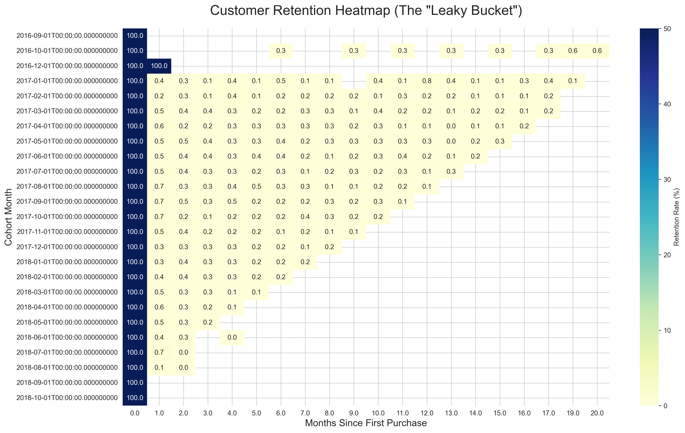
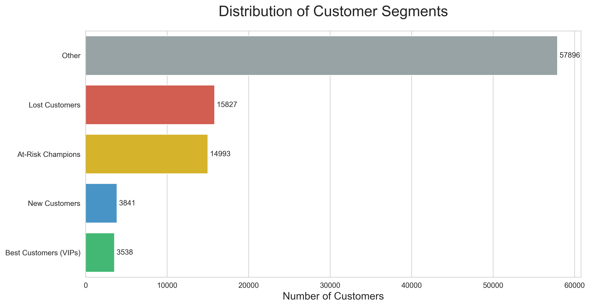

# 🛒 E-Commerce Retention & RFM Segmentation Analysis


## 📋 Executive Summary
**Goal:** To diagnose a suspected retention issue in an e-commerce dataset (100k+ orders) and develop a data-driven segmentation strategy to optimize marketing ROI.

**Key Findings:**
1.  **The "Leaky Bucket" is Real:** Diagnosed a critical failure in customer retention. A Cohort Analysis revealed that **99% of new customers never return** for a second purchase (0% retention rate after Month 1).
2.  **VIP Opportunity:** An RFM Segmentation identified that despite high churn, a top **1% of "Best Customers"** exists.
3.  **Strategy Shift:** The business must shift budget from broad acquisition (which is burning cash) to targeted retention of "At-Risk" and "New" customers.

---

## 🔍 Part 1: The Diagnosis (Cohort Analysis)
**The Business Problem:** The marketing team suspected that while acquisition numbers were high, long-term value was low. They needed proof of the "Leaky Bucket" hypothesis.

**The Approach:**
I performed a **Time-Based Cohort Analysis** using advanced SQL to track customer behavior over time.
* **SQL Skills Used:** Common Table Expressions (CTEs), `DATE_TRUNC`, `MIN()` for cohort definition, and Window Functions (`FIRST_VALUE`) to calculate retention percentages.

**The Visual Proof:**
*(See `images/cohort_heatmap.png`)*


**Insight:**
* The heatmap shows a sharp drop-off. Columns 1.0 through 5.0 are nearly white (0-1% retention).
* This proves that customers are not forming habits; they are transactional "one-and-done" buyers.

---

## 🛠️ Part 2: The Solution (RFM Segmentation)
**The Strategy:** Since mass marketing is failing (due to high churn), I moved to a segmented approach to identify the few high-value customers worth investing in.

**The Approach:**
I built an **RFM (Recency, Frequency, Monetary)** model to score every customer on a scale of 1-5.
* **Recency:** Days since last purchase.
* **Frequency:** Total count of orders.
* **Monetary:** Total lifetime spend.
* **SQL Skills Used:** `MAX()`, `COUNT(DISTINCT)`, `SUM()`, Date Math, Window Functions (`NTILE` for scoring), and `CASE` statements for segmentation.

**The Visual Proof:**
*(See `images/rfm_segments.png`)*


**Insight:**
* **"Lost Customers"** (Red) make up the vast majority of the database.
* **"Best Customers"** (Green) are a tiny fraction but drive the highest ROI.
* **"At-Risk Champions"** (Yellow) represent the immediate financial opportunity for "Win-Back" campaigns.

---

## 💡 Final Recommendations
Based on this analysis, I recommend the following actions for the marketing team:

| Segment | Who they are | Actionable Strategy |
| :--- | :--- | :--- |
| **Best Customers (VIP)** | R=5, F=5, M=5 | **Protect & Upsell:** Offer exclusive access, loyalty perks, and "Thank You" gifts. Do NOT discount. |
| **At-Risk Champions** | High F/M, Low R | **Win-Back:** Send aggressive offers (e.g., "We Miss You - 20% Off"). They are high value but fading. |
| **New Customers** | High R, Low F | **Nurture:** Focus entirely on securing the *second purchase*. Send welcome series and setup guides. |
| **Lost Customers** | Low R, F, M | **Ignore:** Stop wasting ad spend. These customers have churned and are low value. |

---

## 📂 Repository Structure
```text
├── data/                   # Raw CSV files (Customers, Orders, Payments)
├── images/                 # Visualizations (Heatmap, Bar Chart)
├── Project_Analysis.ipynb  # The complete Jupyter Notebook (SQL + Python)
└── README.md               # Project Overview
